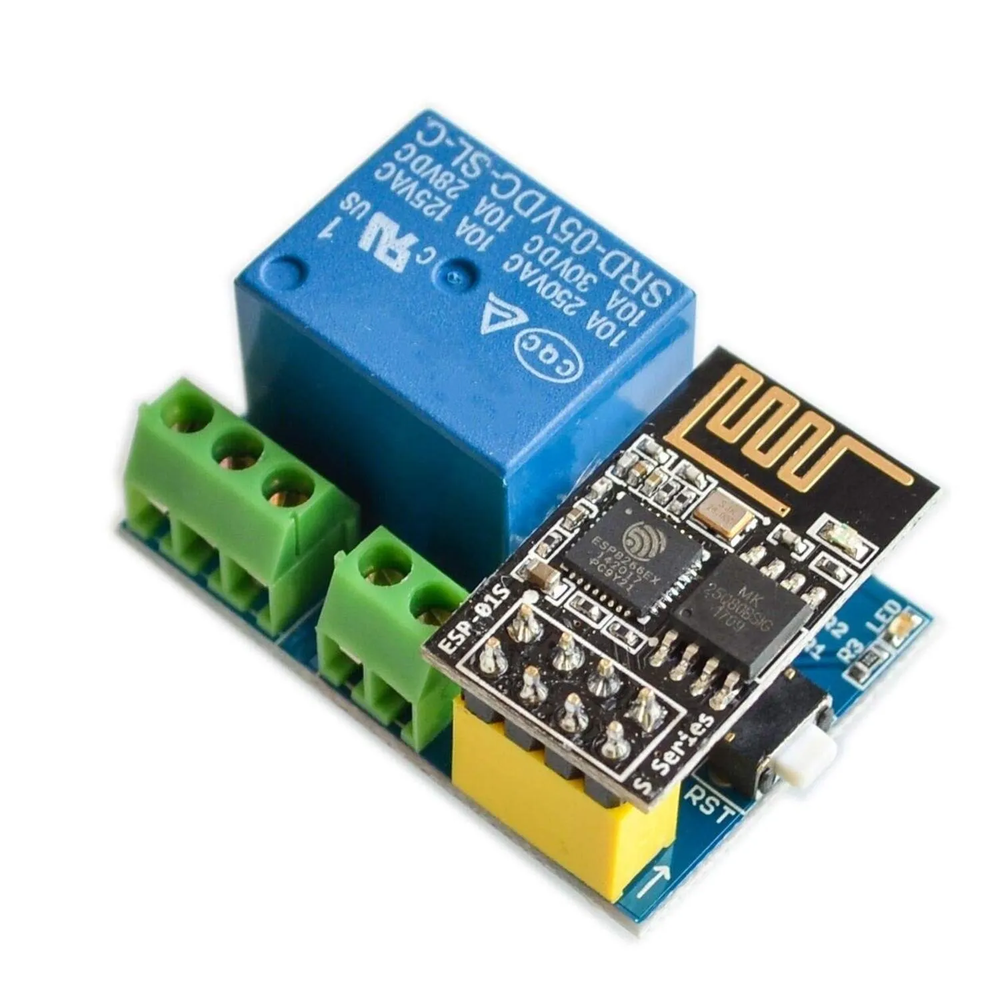
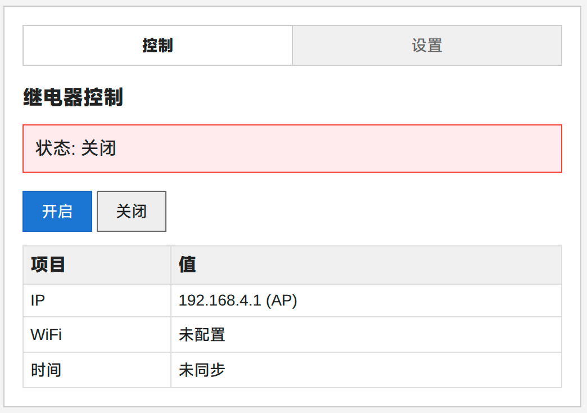
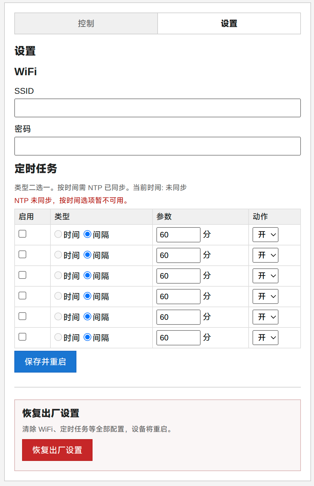

# ESP-01S 继电器控制

基于 ESP8266 ESP-01S 的 WiFi 继电器固件。通过网页手动开关，支持 AP 配网、定时任务与恢复出厂设置。



## 硬件

| 引脚    | 功能     | 说明                 |
| ----- | ------ | ------------------ |
| GPIO0 | 继电器    | 低电平触发，上电默认关闭       |
| GPIO2 | 板载 LED | WiFi 未连接时闪烁，已连接时常亮 |

适用 ESP-01S 模块，Flash 建议大于等于1MB。

## 功能

- **AP 配网**：未配置 WiFi 或连接失败时开启热点 `ESP-Relay`，连接成功后关闭 AP；断线后重新开启
- **网页控制**：手动开/关继电器，查看 IP、WiFi 状态、信号与时间
- **定时任务**：最多 6 条，每条可选一种触发方式
  - **按时间**：每天在指定时:分执行，需 WiFi 已连接且 NTP 已同步
  - **按间隔**：每隔 N 分钟执行，范围 1–1440 分钟，不依赖 NTP
- **恢复出厂设置**：清除全部配置并重启
- **配置持久化**：WiFi 与定时任务保存在 Flash，掉电不丢失

## 首次使用

1. 烧录固件并上电
2. 手机或电脑连接 WiFi 热点 `ESP-Relay`
3. 浏览器打开 `http://192.168.4.1`
4. 进入「设置」，填写 WiFi SSID 与密码，按需配置定时任务
5. 点击「保存并重启」，设备连上路由器后 AP 自动关闭
6. 通过局域网 IP 访问控制页

## 网页说明

| 页面  | 路径          | 内容               |
| --- | ----------- | ---------------- |
| 控制  | `/`         | 继电器开关、设备状态       |
| 设置  | `/settings` | WiFi、定时任务、恢复出厂设置 |

**控制页**



**设置页**



## 定时任务说明

- 每条任务只能选「时间」或「间隔」之一
- 按时间任务在 NTP 未同步时不可新建或保存；已保存的任务在重启后也会等到 NTP 同步完成才开始执行
- 按间隔任务从设备启动或上次触发起计时，使用内部定时器 `millis()`，与网络时间无关

## 编译与烧录

可以使用Arduino IDE，也可以使用 `arduino-cli`：

```bash
arduino-cli compile \
  --fqbn esp8266:esp8266:generic \
  --build-property "build.flash_size=1M" \
  ./esp-01s-relay

arduino-cli upload \
  --fqbn esp8266:esp8266:generic \
  --build-property "build.flash_size=1M" \
  -p /dev/ttyUSB0 \
  ./esp-01s-relay
```

将 `-p` 替换为实际串口。上传前 ESP-01S 需进入烧录模式：GPIO0 接 GND 后重新上电，建议使用ESP-Prog下载器，方便快捷无需手动操作进入烧录模式。

## 依赖

- ESP8266 Arduino Core 3.x
- 内置库：`ESP8266WiFi`、`ESP8266WebServer`、`Preferences`

## 默认参数

| 项         | 值                           |
| --------- | --------------------------- |
| AP 名称     | `ESP-Relay`                 |
| AP IP     | `192.168.4.1`               |
| Web 端口    | 80                          |
| 时区        | UTC+8                       |
| NTP 服务器   | ntp.aliyun.com、pool.ntp.org |
| WiFi 重连间隔 | 30 秒                        |

## 文件

```
esp-01s-relay/
├── esp-01s-relay.ino
├── control.png       # 控制页截图
├── settings.png      # 设置页截图
├── relay.webp        # 硬件照片
├── LICENSE
└── README.md
```

## 开源协议

本项目采用 [MIT License](LICENSE)。

可自由使用、修改、分发与商用，无需付费。使用时保留版权声明与许可全文即可。
